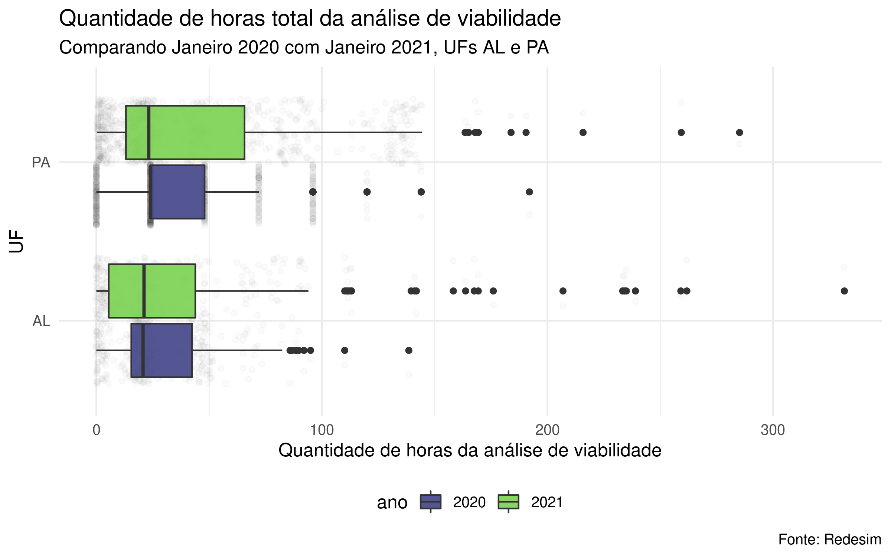

<!-- README.md is generated from README.Rmd. Please edit that file -->

# redesim 

<!-- badges: start -->
<!-- badges: end -->

A Rede Nacional para a Simplificação do Registro e da Legalização de
Empresas e Negócios (Redesim) é uma rede de sistemas que integra os
sistemas da maioria dos municípios e juntas comerciais de todo o Brasil.
O objetivo da Redesim é simplificar os procedimentos e reduzir tempo e
custo para registro de novas empresas. As metas da Redesim está alinhada
com as métricas do Doing Business, relatório do Banco Mundial que mede a
capacidade do país para fazer negócios.

Os dados da Redesim, apesar de serem acessíveis, não são abertos. O
objetivo do pacote `{redesim}` é baixar e organizar os dados de tempos
para abertura de empresas, disponíveis no site da Redesim. Os dados
estão disponíveis desde 2019 e são atualizados mensalmente.

O pacote faz parte dos trabalhos que estão sendo realizados pela ABJ em
parceria com o Departamento Nacional de Registro Empresarial e
Integração (DREI), do Ministério da Economia.

## Instalação

``` r
# install.packages("remotes")
remotes::install_github("abjur/redesim")
```

## Exemplo

Exemplo básico de como baixar os dados para um mês e um ano específico.

``` r
library(redesim)
da <- redesim::redesim_fetch(2020:2021, c(1), c("AL", "PA"))
#> Ano: 2020, mes: 1, uf: AL
#> Ano: 2020, mes: 1, uf: PA
#> Ano: 2021, mes: 1, uf: AL
#> Ano: 2021, mes: 1, uf: PA
dplyr::glimpse(da)
#> Rows: 2,357
#> Columns: 42
#> $ ano_mes_uf                    <chr> "2020-01_AL", "2020-01_AL", "2020-01_AL"…
#> $ serial                        <chr> "AL20012900001", "AL20011700002", "AL200…
#> $ dt_inic_viabilidade           <date> 2020-01-24, 2019-12-05, 2020-01-27, 201…
#> $ hh_inic_viabilidade           <Period> 11H 7M 56S, 14H 1M 53S, 14H 44M 16S, …
#> $ dt_fim_viabilidade_nome       <date> 2020-01-24, 2019-12-08, 2020-01-28, 201…
#> $ hh_fim_viabilidade_nome       <Period> 11H 34M 47S, 23H 34M 12S, 9H 43M 28S,…
#> $ qtde_hh_viabilidade_nome      <dbl> 0.45, 57.55, 18.98, 5.33, 49.63, 19.95, …
#> $ dt_fim_viabilidade_end        <date> 2020-01-24, 2019-12-06, 2020-01-28, 201…
#> $ hh_fim_viabilidade_end        <Period> 11H 9M 10S, 1H 19M 52S, 13H 51M 18S, …
#> $ qtde_hh_viabilidade_end       <dbl> 0.04, 11.30, 23.12, 0.00, 0.00, 0.00, 85…
#> $ dt_fim_viabilidade_total      <date> 2020-01-24, 2019-12-08, 2020-01-28, 201…
#> $ hh_fim_viabilidade_total      <Period> 11H 34M 47S, 23H 34M 12S, 13H 51M 18S…
#> $ qtde_hh_viabilidade_total     <dbl> 0.45, 57.55, 23.12, 5.33, 49.63, 19.95, …
#> $ data_transmissao              <date> 2020-01-27, 2019-12-09, 2020-01-28, 202…
#> $ hora_transmissao              <chr> "18:23:00", "09:16:37", "16:04:57", "09:…
#> $ qtde_hh_transmissao           <dbl> 30.82, 9.70, 2.21, 235.65, 4.65, 1.05, 0…
#> $ data_liberacao_dbe            <date> 2020-01-27, 2019-12-09, 2020-01-28, 202…
#> $ hora_liberacao_dbe            <chr> "22:31:28", "13:31:16", "19:43:14", "09:…
#> $ qtde_hh_liberacao_dbe         <dbl> 4.13, 4.25, 3.65, 0.09, 0.07, 0.09, 3.28…
#> $ data_recebimento_dbe          <date> 2020-01-29, 2019-12-26, 2020-01-30, 202…
#> $ hh_recebimento_dbe            <Period> 16H 20M 16S, 8H 17M 5S, 9H 38M 28S, 1…
#> $ qtde_hh_recebimento_dbe       <dbl> 41.82, 282.77, 37.92, 243.35, 70.63, 23.…
#> $ ind_rec_dbe                   <chr> "S05", "S05", "S05", "S05", "S05", "S05"…
#> $ data_deferimento              <date> 2020-01-29, 2020-01-17, 2020-01-30, 202…
#> $ hora_deferimento              <chr> "17:30:09", "08:21:59", "13:09:03", "12:…
#> $ qtde_horas_deferimento        <dbl> 1.17, 360.07, 3.52, 0.10, 74.27, 0.10, 0…
#> $ ind_lib_dbe                   <chr> "S06", "S06", "S06", "S06", "S06", "S06"…
#> $ municipio                     <chr> "MACEIO", "MACEIO", "ARAPIRACA", "MACEIO…
#> $ uf                            <chr> "AL", "AL", "AL", "AL", "AL", "AL", "AL"…
#> $ nat_jur                       <chr> "230", "206", "213", "230", "230", "213"…
#> $ atividade_economica_principal <chr> "4664800", "4651601", "4754701", "620400…
#> $ tipo_de_unidade               <chr> "Unidade Produtiva", "Unidade Produtiva"…
#> $ forma_atuacao_01              <chr> "S", "S", "S", "S", "N", "S", "S", "S", …
#> $ forma_atuacao_02              <chr> "N", "N", "N", "N", "N", "N", "N", "N", …
#> $ forma_atuacao_03              <chr> "N", "N", "N", "N", "N", "N", "N", "N", …
#> $ forma_atuacao_04              <chr> "N", "N", "N", "N", "N", "N", "N", "N", …
#> $ forma_atuacao_05              <chr> "N", "N", "N", "N", "N", "N", "N", "N", …
#> $ forma_atuacao_06              <chr> "N", "N", "N", "N", "N", "N", "N", "N", …
#> $ forma_atuacao_07              <chr> "N", "N", "N", "N", "N", "N", "N", "N", …
#> $ forma_atuacao_08              <chr> "N", "N", "N", "N", "N", "N", "N", "N", …
#> $ tipo_orgao_registro           <chr> "Junta Comercial", "Junta Comercial", "J…
#> $ cnae                          <list> [<tbl_df[99 x 2]>], [<tbl_df[99 x 2]>],…
```

``` r
library(ggplot2)
da %>% 
  dplyr::mutate(ano = stringr::str_sub(ano_mes_uf, 1, 4)) %>% 
  ggplot(aes(y = uf, x = qtde_hh_viabilidade_total, fill = ano)) +
  geom_jitter(
    alpha = .02,
    position = position_dodge2(width = .8)
  ) +
  geom_boxplot() +
  scale_fill_viridis_d(begin = .2, end = .8, alpha = .9) +
  theme_minimal(12) +
  labs(
    x = "Quantidade de horas da análise de viabilidade",
    y = "UF",
    fill = "ano",
    title = "Quantidade de horas total da análise de viabilidade",
    subtitle = "Comparando Janeiro 2020 com Janeiro 2021, UFs AL e PA",
    caption = "Fonte: Redesim"
  ) +
  theme(legend.position = "bottom")
```


